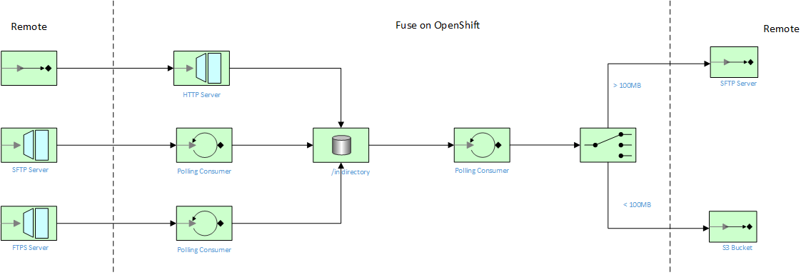

= Fuse on OpenShift Managed File Transfer (MFT) Proof of Concept (PoC)

== Overview
This project demonstrates a bunch of different endpoints (HTTPS and SFTP) to stream (or transfer) files into OpenShift and trigger a series of Camel Routes.  It also makes use of Fuse Ignite IPaaS to faciliate tracking and visibility of files as they pass through the system.

== Deployment options

This booster can run in the following modes:

* Standalone on your machine
* Single-node OpenShift cluster

The most effective way to demonstrate this project is to deploy and run the project on OpenShift.
For more details about running this booster on a single-node OpenShift cluster, CI/CD deployments, as well as the rest of the runtime, see the link:http://appdev.openshift.io/docs/spring-boot-runtime.html[Spring Boot Runtime Guide].

== Installation Prerequisites

1. Install Fuse Ignite on your OpenShift Container Platform.  Follow these instructions link:https://access.redhat.com/documentation/en-us/red_hat_fuse/7.0/html/integrating_applications_with_ignite/installing-on-ocp[here].

IMPORTANT: This booster requires Java 8 JDK or greater and Maven 3.3.x or greater.